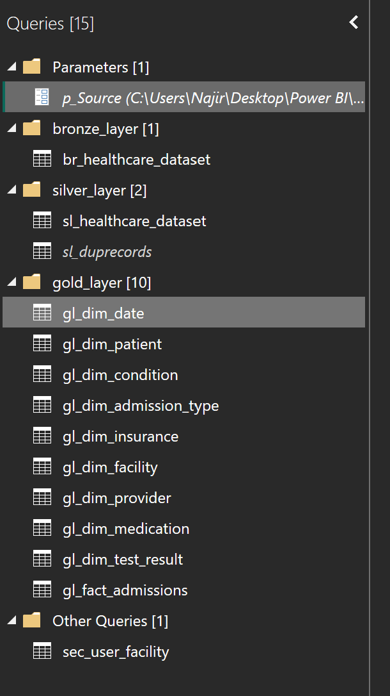
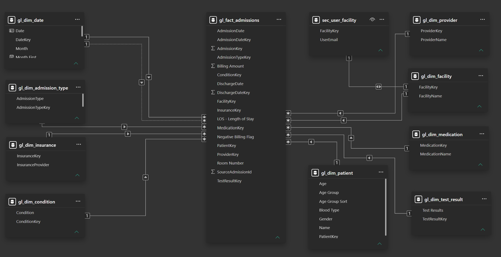
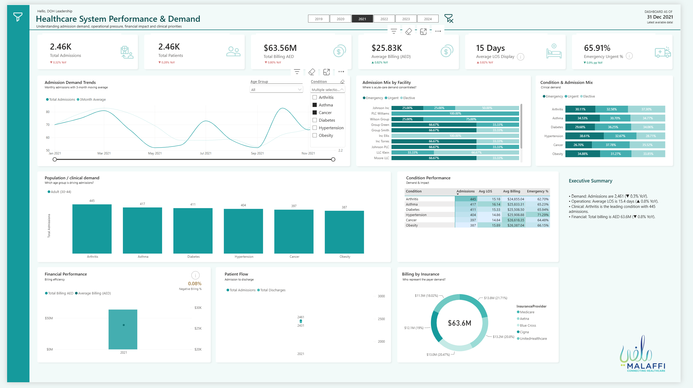
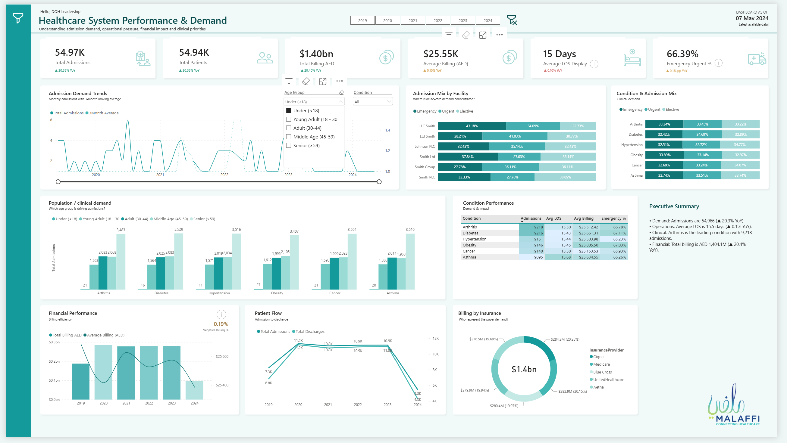
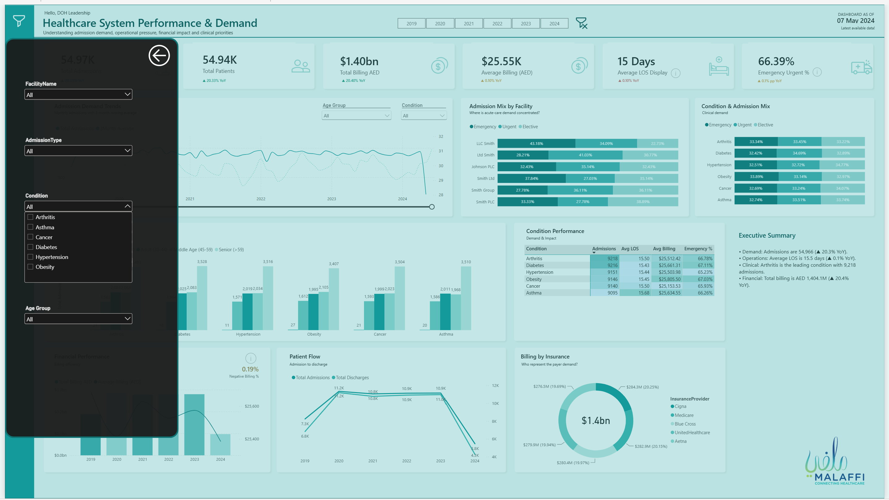

# Department of Health Healthcare BI Project

> **Healthcare System Performance & Demand — Power BI Case Study**

A healthcare BI case study focused on turning raw admission-level data into a clean, scalable Power BI model and an executive dashboard for understanding **demand, clinical activity, operational pressure and financial performance**.

This project was designed around the kinds of questions a healthcare leadership / DOH stakeholder would need to answer:

- How much demand are we seeing?
- Which conditions and facilities are driving admissions?
- What is the patient age-group mix?
- How are emergency, urgent and elective admissions distributed?
- What is the average length of stay?
- How much is being billed, and through which insurers?
- How are admissions and discharges moving over time?
- Can leadership explore the data by year, facility, condition, admission type and age group?

---

## 1. The Problem

Healthcare data can quickly become difficult to use when everything sits in one large flat table.

The challenge was not simply to build a dashboard. The goal was to create a small **analytics pipeline** that could take raw healthcare data, identify data-quality issues, structure it into an analytical model, and then make the results easy for non-technical stakeholders to understand.

### Key problems we wanted to solve

**1. Raw data was not analysis-ready**

The source dataset contained admission, patient, clinical, facility, provider, medication, insurance and test-result information together.

We needed to separate these into logical business entities before building the report.

**2. Data quality needed attention**

During profiling, we identified issues such as:

- Exact duplicate records
- Missing business identifiers such as Patient ID / Encounter ID / Admission ID
- Suspiciously high-cardinality fields such as provider and facility names
- Negative billing records
- Patient-level duplication risk

Instead of hiding these issues, the project explicitly profiled and handled them before reporting.

**3. Healthcare metrics needed clear definitions**

Metrics such as:

- Admissions
- Unique patients
- Length of Stay (LOS)
- Average billing
- Emergency admission %
- Total billing
- Negative billing %

needed to be defined consistently so that different visuals told the same story.

**4. Leadership needed one view of demand + impact**

The final report combines:

**Demand → Clinical → Operations → Financial**

rather than showing isolated charts.

---

## 2. Our Approach

The project follows a simple **Bronze → Silver → Gold** approach.

```text
Raw Healthcare Dataset
        ↓
   Bronze Layer
        ↓
   Silver Layer
   Data Cleaning
   Quality Checks
        ↓
    Gold Layer
 Dimensional Model
        ↓
     Power BI
   DAX + RLS
        ↓
Executive Dashboard
```

The idea was to keep transformation logic separate from the reporting layer.

---

## 3. Bronze Layer — Preserve the Source

The Bronze layer keeps the source data close to its original form.

```text
br_healthcare_dataset
```

This gives us a stable starting point and makes it easier to trace transformations back to the original data.



---

## 4. Silver Layer — Clean & Validate

The Silver layer is where the raw data becomes usable.

```text
sl_healthcare_dataset
sl_duprecords
```

Key activities included:

- Data-type standardisation
- Duplicate detection
- Duplicate handling
- Data-quality profiling
- Billing validation
- Creation of clean analytical fields
- Preparation of keys required by the Gold model

### Data-quality findings

The dataset contained approximately **55.5K records**.

Some of the important findings included:

- **504 exact duplicate records**
- Duplicate rate of approximately **0.91%**
- **108 negative billing records**
- No obvious missing values across the main dataset
- No reliable native Patient ID / Encounter ID / Admission ID in the source

Because the source did not contain a reliable patient identifier, a surrogate **PatientKey** was created using available patient attributes.

---

## 5. Gold Layer — Build the Business Model

Instead of connecting Power BI directly to one large table, the Gold layer separates facts and dimensions.

### Fact

```text
gl_fact_admissions
```

Contains admission-level measures and foreign keys such as:

- Admission
- Admission date
- Discharge date
- Billing amount
- Length of Stay
- Patient
- Facility
- Provider
- Condition
- Insurance
- Medication
- Test result
- Admission type

### Dimensions

```text
gl_dim_date
gl_dim_patient
gl_dim_condition
gl_dim_admission_type
gl_dim_insurance
gl_dim_facility
gl_dim_provider
gl_dim_medication
gl_dim_test_result
```

This creates a cleaner analytical model and makes DAX measures easier to maintain.



---

## 6. Patient & Business Key Challenge

One of the more interesting parts of the project was the absence of a proper patient identifier.

The source did not provide a reliable Patient ID, so we had to think about how to identify a patient consistently.

A surrogate `PatientKey` was created from available attributes such as:

```text
Name + Age + Gender + Blood Type
```

The resulting patient dimension contained approximately **54.9K unique patient records**.

This is not the same as having a true enterprise Patient ID, so the limitation is intentionally documented rather than hidden.

---

## 7. Metrics That Matter

The dashboard was built around a small set of business-friendly KPIs.

### Demand

- Total Admissions
- Total Patients
- Admissions trend
- Admissions by condition
- Admissions by age group
- Admissions by facility

### Clinical

- Condition volume
- Emergency / Urgent / Elective mix
- Average Length of Stay
- Condition-level performance

### Operations

- Patient flow
- Admissions vs discharges
- Facility-level admission mix
- Emergency admission %

### Financial

- Total Billing
- Average Billing
- Billing by insurance provider
- Negative billing %

---

## 8. Dashboard Design

The dashboard was intentionally designed as an **executive overview first**, with the ability to drill into the underlying drivers.

### Executive KPI layer

The top section gives leadership an immediate snapshot:

- Total Admissions
- Total Patients
- Total Billing
- Average Billing
- Average LOS
- Emergency Urgent %



---

## 9. Demand & Clinical Analysis

The main analytical section focuses on:

### Admission Demand Trends

Shows how admissions are changing over time, with a 3-month moving average to make the underlying trend easier to see.

### Admission Mix by Facility

Breaks each facility's admissions into:

- Emergency
- Urgent
- Elective

This helps identify where acute-care demand is concentrated.

### Condition & Admission Mix

Shows how different conditions are distributed across admission types.

### Population / Clinical Demand

Breaks condition demand by age group to answer questions such as:

> Which age groups are contributing most to admissions for each major condition?

---

## 10. Operational & Financial View

### Condition Performance

A compact table brings together:

- Admissions
- Average LOS
- Average Billing
- Emergency %

This makes it easier to identify conditions with high demand and operational impact.

### Patient Flow

Admissions and discharges are compared over time to provide a simple view of patient movement.

### Financial Performance

Total billing and average billing are shown together so that volume and financial impact can be viewed in the same context.

### Billing by Insurance

A breakdown of total billing by insurance provider shows payer contribution to the overall financial picture.

---

## 11. Interactive Experience

The report is not just a collection of static charts.

Users can filter the dashboard by:

- Year
- Facility
- Admission Type
- Condition
- Age Group

A custom filter panel was also created to keep the main dashboard clean while still allowing users to access detailed filters.



The age-group and condition slicers allow users to move from the executive view into a more focused analysis.



---

## 12. Security

A facility-level security table was also introduced:

```text
sec_user_facility
```

This supports a Row-Level Security approach where access can be restricted based on the user's email and assigned facility.

Conceptually:

```text
User Email
     ↓
sec_user_facility
     ↓
Facility
     ↓
Admissions
```

This makes the model more realistic for a healthcare environment where different users may need access to different facilities.

---

## 13. Power BI / Technical Stack

### Data & Transformation

- Power Query
- Parameterised source path
- Bronze / Silver / Gold architecture
- Data profiling
- Duplicate detection
- Data cleansing
- Surrogate key generation

### Data Modelling

- Star-schema approach
- Fact and dimension tables
- Date dimension
- One-to-many relationships
- Role-based filtering
- Surrogate keys

### Analytics

- DAX measures
- Time intelligence
- Moving averages
- KPI calculations
- Conditional analysis
- YoY comparisons

### Reporting

- Power BI
- Executive KPI cards
- Custom slicer panels
- Bookmarks
- Interactive filtering
- RLS
- Executive storytelling

---

## 14. What This Project Demonstrates

This project is less about making a visually attractive Power BI dashboard and more about demonstrating the full BI workflow:

```text
Business Problem
      ↓
Data Profiling
      ↓
Data Quality
      ↓
Transformation
      ↓
Data Modelling
      ↓
DAX / Analytics
      ↓
Security
      ↓
Executive Reporting
```

The final output turns a raw healthcare dataset into a model that can answer practical questions around **demand, clinical conditions, operational pressure and financial performance**.

---

## 15. Final Dashboard


---

## 16. Important Note

This repository is a **portfolio / learning case study** built using a healthcare admissions dataset.

It does **not contain real patient records or confidential healthcare information**.

The project is intended to demonstrate how a healthcare BI solution can be structured from data ingestion through modelling, analytics, security and executive reporting.

---

## Project Structure

```text
malaffi-project/
│
├── README.md
│
└── assets/
    ├── power-query-architecture.png
    ├── data-model.png
    ├── dashboard-custom-slicers.png
    ├── dashboard-filter-panel.png
    └── dashboard-final.png
```

## Outcome

**Raw healthcare data → Clean analytical model → Secure Power BI model → Executive healthcare dashboard**

The main objective was simple:

> **Make healthcare data easier to understand, easier to explore, and more useful for decision-making.**
